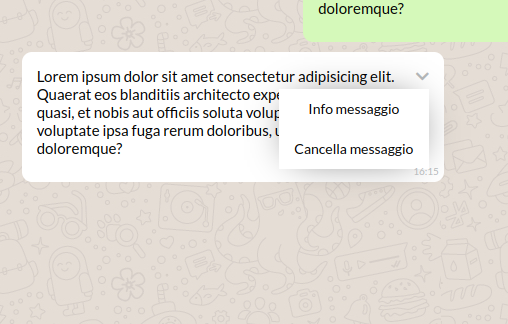

# Boolzapp - a (not very) innovative messaging platform
Nome Repo: **vue-boolzapp**

## Milestone 1

- **Replica della grafica** con la possibilità di avere messaggi scritti dall’utente (verdi) e dall’interlocutore (bianco) assegnando due classi CSS diverse
- **Visualizzazione dinamica della lista contatti**: tramite la direttiva v-for, visualizzare nome e immagine di ogni contatto

## Milestone 2

- **Visualizzazione dinamica dei messaggi**: tramite la direttiva v-for, visualizzare tutti i messaggi relativi al contatto attivo all’interno del pannello della conversazione
- **Click sul contatto** mostra la conversazione del contatto cliccato

## Milestone 3

- **Aggiunta di un messaggio**: l’utente scrive un testo nella parte bassa e digitando
  “enter” il testo viene aggiunto al thread sopra, come messaggio verde
- **Risposta dall’interlocutore**: ad ogni inserimento di un messaggio, l’utente riceverà un “ok” come risposta, che apparirà dopo 1 secondo.

## Milestone 4

- **Ricerca utenti**: scrivendo qualcosa nell’input a sinistra, vengono visualizzati solo i contatti il cui nome contiene le lettere inserite (es, Marco, Matteo Martina -> Scrivo “mar” rimangono solo Marco e Martina)

## Milestone 5 - opzionale

- **Cancella messaggio**: cliccando sul messaggio appare un menu a tendina che permette di cancellare il messaggio selezionato
  
- **Visualizzazione ora e ultimo messaggio inviato/ricevuto** nella lista dei contatti

## Bonus aggiuntivi:

- evitare che l'utente possa inviare un messaggio vuoto o composto solamente da spazi
- A. cambiare icona in basso a destra (a fianco all'input per scrivere un nuovo messaggio) finché l'utente sta scrivendo: di default si visualizza l'icona del microfono, quando l'input non è vuoto si visualizza l'icona dell'aeroplano. Quando il messaggio è stato inviato e l'input si svuota, si torna a visualizzare il microfono.
  B. inviare quindi il messaggio anche cliccando sull'icona dell'aeroplano
- predisporre una lista di frasi e/o citazioni da utilizzare al posto della risposta "ok:" quando il pc risponde, anziché scrivere "ok", scegliere una frase random dalla lista e utilizzarla come testo del messaggio di risposta del pc
- sotto al nome del contatto nella parte in alto a destra, cambiare l'indicazione dello stato: visualizzare il testo "sta scrivendo..." nel timeout in cui il pc risponde, poi mantenere la scritta "online" per un paio di secondi e infine visualizzare "ultimo accesso alle xx:yy" con l'orario corretto
- dare la possibilità all'utente di cancellare tutti i messaggi di un contatto o di cancellare l'intera chat con tutti i suoi dati: cliccando sull'icona con i tre pallini in alto a destra, si apre un dropdown menu in cui sono presenti le voci "Elimina messaggi" ed "Elimina chat"; cliccando su di essi si cancellano rispettivamente tutti i messaggi di quel contatto (quindi rimane la conversazione vuota) oppure l'intera chat comprensiva di tutti i dati del contatto oltre che tutti i suoi messaggi (quindi sparisce il contatto anche dalla lista di sinistra)
- dare la possibilità all'utente di aggiungere una nuova conversazione, inserendo in un popup il nome e il link all'icona del nuovo contatto

### Consigli utili:

- Si possono trascurare le scrollbar verticali, sia nel pannello dei messaggi, che nella lista dei contatti
- I pulsanti e le icone possono non funzionare (a parte l’invio del messaggio)
- Per gestire le date, può essere utile la libreria [Luxon](https://moment.github.io/luxon/#/?id=luxon)
